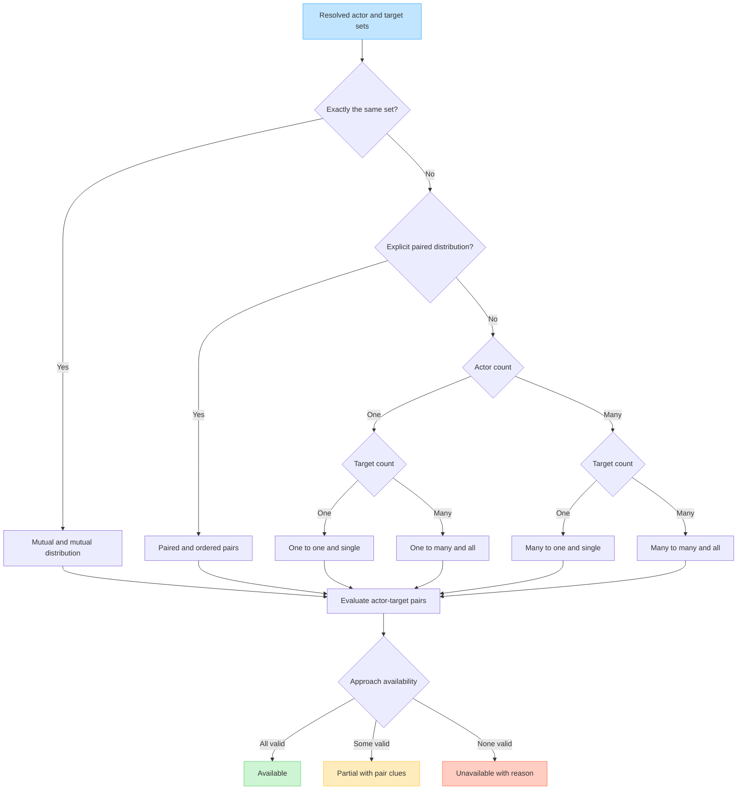

# Canonical Interaction Tree and UI Map

This document maps the current player-command contract. It covers the shared
primary interaction families, their approaches, self and group shapes,
mode-specific timing, contextual utilities, and the desktop/mobile UI surfaces
that expose them.

The canonical grammar is:

`Actor(s) -> Target(s) -> Intent -> Approach -> Timing -> Resolution`

Exploration and combat may impose different timing and reach constraints, but
they must not invent different interaction families or approach meanings.

## 1. Primary interaction and approach tree

The player-facing primary labels stay safe and broad. Content posture changes
which approaches are visible and how they are labeled; it does not replace the
primary family or route the command through a different mechanic.

```mermaid
flowchart TD
    primary["Primary interaction families"]
    primary --> fight["Fight"]
    primary --> talk["Talk: flirt family"]
    primary --> eat["Eat: feast family"]
    primary --> play["Play: fuck family"]
    primary --> feed["Feed"]

    fight --> fightBasic["Basic Attack"]
    fight --> fightTechnique["Registered techniques"]
    fight --> fightControl["Combat control"]
    fightControl --> grab["Grab"]
    grab -->|"Enables"| pull["Pull"]

    talk --> flirt["Flirt or safe Talk"]
    talk --> seduce["Seduce: mature mechanical"]

    eat --> eatTarget["Target approaches"]
    eat --> eatSelf["Self approaches"]
    eatTarget --> swallow["Swallow or safe Eat"]
    eatTarget --> chew["Chew: mature and setting gated"]
    eatTarget --> capture["Capture: content and setting gated"]
    eatTarget --> engulf["Engulf: content and setting gated"]
    eatSelf --> digest["Digest or safe Break Down"]
    eatSelf --> release["Release or safe Free"]

    play --> playCore["Fuck or safe Play"]
    play -.-> dominate["Dominate: deferred"]
    play -.-> submit["Submit: deferred"]

    feed --> tend["Tend: self or target"]
    feed --> nurse["Nurse"]
    feed --> offerWhole["Offer Self"]
    feed --> offerPiece["Offer Piece"]

    style primary fill:#C2E5FF,stroke:#3DADFF
    style fight fill:#C6FAF6,stroke:#5AD8CC
    style talk fill:#C6FAF6,stroke:#5AD8CC
    style eat fill:#C6FAF6,stroke:#5AD8CC
    style play fill:#C6FAF6,stroke:#5AD8CC
    style feed fill:#C6FAF6,stroke:#5AD8CC
    style seduce fill:#DCCCFF,stroke:#874FFF
    style dominate fill:#D9D9D9,stroke:#B3B3B3
    style submit fill:#D9D9D9,stroke:#B3B3B3
```

Important registry details:

- Fight's canonical chooser is `YAW_COMBAT_TECHNIQUES`: Basic Attack,
  eligible module techniques, and the combat-only Grab/Pull control profiles.
  The older `fight.attack`, `fight.disarm`, and `fight.grapple` sub-action
  definitions are not used by that chooser.
- Flirt is the one ordinary Talk approach. Compatibility-era `dance` defaults
  and queued commands normalize to Flirt before planning or resolution. Seduce
  routes through the `core:seduce` mechanical action profile.
- Play currently has one active approach. Dominate and Submit are deliberately
  deferred until they have distinct resolved outcomes.
- Feed's legacy adapters (`heal`, `breastfeed`, `sacrifice`, `forceFeed`,
  `slurp`, and `fragment`) are excluded from the normal approach menu.
- Eat self approaches are resolved against each selected actor. They do not
  require a separate target, which is what permits Digest during combat.
- The Feast-family player-facing label is `Eat` in exploration and combat,
  including single, group, desktop, and mobile surfaces. The internal action id
  remains `feast` for saves, modules, and resolver compatibility.

## 2. Contextual and utility interaction tree

These commands share the same command surface but are not members of the five
primary interaction families.

```mermaid
flowchart TD
    utility["Contextual and utility commands"]
    utility --> living["Living target"]
    utility --> remains["Remains target"]
    utility --> place["Place and traversal"]
    utility --> battle["Combat utility"]
    utility --> contributed["Module action profiles"]

    living --> inspect["Inspect"]
    living --> recruit["Recruit or Rejoin"]
    living --> quest["Accept or View Quest"]
    living --> trade["Trade"]

    remains --> loot["Loot"]
    remains --> scavenge["Scavenge"]

    place --> movement["Directional movement"]
    place --> enterExit["Enter or Exit"]
    place --> search["Search"]
    place --> rest["Rest"]
    place --> setHome["Set Home"]
    place --> takeItems["Take Items"]

    battle --> moveRow["Advance or Retreat row"]
    battle --> flee["Flee attempt"]
    battle --> skip["Skip turn"]
    battle --> battleScavenge["Scavenge remains"]
    battle --> escape["Escape restraint profile"]
    battle -.-> legacySync["Legacy Sync route"]

    contributed --> directProfile["Direct eligible profile"]
    contributed --> moreProfiles["More Actions disclosure"]

    style utility fill:#C2E5FF,stroke:#3DADFF
    style living fill:#FFECBD,stroke:#FFC943
    style remains fill:#FFECBD,stroke:#FFC943
    style place fill:#FFECBD,stroke:#FFC943
    style battle fill:#FFECBD,stroke:#FFC943
    style contributed fill:#FFECBD,stroke:#FFC943
    style legacySync fill:#D9D9D9,stroke:#B3B3B3
```

The `flee` registry still contains Run, Retreat, and Surrender definitions, but
the current combat Flee button directly invokes the combat escape attempt; it
does not open that registry as an approach menu.

## 3. Actor-target cardinality and group semantics

The interaction shape is derived from resolved unit sets, not from the UI that
started the command.

Exceptions are explicit rather than new trees:

- Group Seduce requires every selected actor-target evaluation to be valid.
- Combat Feed groups may coordinate Tend and Nurse; the whole-body Feed
  approaches remain visible but unavailable with a reason.
- Grab and Pull require exactly one actor and one target.
- A partial actor-target overlap is many-to-many. It is not Mutual.
- Equal counts never imply Paired; pairing must be explicitly requested.

## 4. UI representation across exploration, combat, desktop, and mobile

Both responsive layouts render the same semantic states. Cards, strips,
popover placement, and sheet placement are presentations, not alternate action
systems.

```mermaid
flowchart LR
    subgraph selectionSurfaces ["Selection surfaces"]
        direction TB
        desktopCards["Desktop party and target cards"]
        mobileRoster["Mobile roster and combat strips"]
        selfTarget["Self selection"]
    end

    selectionState["Shared actor and target state"]
    sentence["Command sentence"]
    mode{"Current mode"}

    subgraph explorationFlow ["Exploration composer"]
        direction TB
        explorationBelt["Primary interaction belt"]
        explorationUtility["Context and place commands"]
        explorationApproach["Shared approach resolver"]
        immediate["Immediate resolution"]
    end

    subgraph combatFlow ["Combat composer"]
        direction TB
        leadActor["Current lead actor"]
        participants["Optional participants"]
        combatMarks["Party enemy or self marks"]
        combatBelt["Primary and combat utility belt"]
        groupCheck{"Multiple actors?"}
        groupCommit["Commit replaces belt"]
        combatApproach["Shared approach resolver"]
        currentTurn["Current-turn resolution"]
        slowestTurn["Queue at slowest participant"]
    end

    presenter{"Viewport presentation"}
    desktopDialog["Desktop anchored dialog"]
    mobileSheet["Mobile modal sheet"]
    selectedApproach["Selected approach"]
    plan["Canonical InteractionPlan"]
    planTiming{"Plan timing"}
    outcome{"Resolved outcome"}
    success["Success Scene Beat"]
    failure["Failure Scene Beat with narration"]
    activity["Activity history and state refresh"]

    desktopCards --> selectionState
    mobileRoster --> selectionState
    selfTarget --> selectionState
    selectionState --> sentence
    sentence --> mode

    mode -->|"Exploration"| explorationBelt
    explorationBelt --> explorationApproach
    explorationUtility --> plan
    explorationApproach --> presenter
    presenter -->|"Wide"| desktopDialog
    presenter -->|"Compact"| mobileSheet
    desktopDialog --> selectedApproach
    mobileSheet --> selectedApproach
    selectedApproach --> plan

    mode -->|"Combat"| leadActor
    leadActor --> participants
    participants --> combatMarks
    combatMarks --> combatBelt
    combatBelt --> groupCheck
    groupCheck -->|"No"| combatApproach
    groupCheck -->|"Yes"| groupCommit
    groupCommit --> combatApproach
    combatApproach --> presenter
    plan --> planTiming
    planTiming -->|"Immediate"| immediate
    planTiming -->|"Current turn"| currentTurn
    planTiming -->|"Slowest participant"| slowestTurn

    immediate --> outcome
    currentTurn --> outcome
    slowestTurn --> outcome
    outcome -->|"Works"| success
    outcome -->|"Fails"| failure
    success --> activity
    failure --> activity

    style selectionSurfaces fill:#C2E5FF,stroke:#3DADFF
    style explorationFlow fill:#C6FAF6,stroke:#5AD8CC
    style combatFlow fill:#FFECBD,stroke:#FFC943
    style success fill:#CDF4D3,stroke:#66D575
    style failure fill:#FFCDC2,stroke:#FF7556
```

The command sentence is also the stable exit surface:

- Actor `x` clears optional group participants without inserting a Cancel Group
  row or moving the interaction belt.
- Target `x` clears marks while preserving the rest of the command where
  possible.
- Intent `x` returns from commit/targeting to the primary action choice.
- Back from an approach dialog restores the preceding targeting state.

Combat may accelerate entry from either side: selecting a family can open
targeting, and marking a target first can make the next family click open the
approach chooser immediately. Both routes must project the same command
sentence and reach the same approach resolver.

## 5. Dispatch and feedback contract

```mermaid
flowchart LR
    command["UI command"]
    normalize["Normalize aliases and family"]
    build["Build InteractionPlan"]
    validate{"Plan valid?"}
    timing{"Timing"}
    adventure["Resolve exploration shape"]
    combat["Resolve current turn"]
    queue["Queue group command"]
    mechanics["Apply mechanics and costs"]
    result{"Attempt succeeds?"}
    failed["Narrate why it failed"]
    succeeded["Narrate what happened"]
    scene["Emit Scene Beat"]
    log["Append Activity history"]
    render["Refresh shared UI state"]

    command --> normalize
    normalize --> build
    build --> validate
    validate -->|"No"| failed
    validate -->|"Yes"| timing
    timing -->|"Immediate"| adventure
    timing -->|"Current turn"| combat
    timing -->|"Slowest participant"| queue
    adventure --> mechanics
    combat --> mechanics
    queue -.-> combat
    mechanics --> result
    result -->|"Yes"| succeeded
    result -->|"No"| failed
    succeeded --> scene
    failed --> scene
    scene --> log
    log --> render

    style command fill:#C2E5FF,stroke:#3DADFF
    style failed fill:#FFCDC2,stroke:#FF7556
    style scene fill:#CDF4D3,stroke:#66D575
```

Failure is a gameplay result, not a warning or application error. Reach,
capacity, fear, restraint, turn-order loss, stale participants, and other
negative outcomes must produce readable Scene Feed narration while keeping the
composer in a recoverable state.

## Source-of-truth modules

| Concern | Current owner |
| --- | --- |
| Family aliases and semantics | `app/src/core/interaction-families.js` |
| Contextual approaches and labels | `app/src/core/sub-actions.js` |
| Fight techniques and controls | `app/src/core/combat-techniques.js`, `app/src/core/action-profiles.js` |
| Plan shape, timing, and distribution | `app/src/core/interaction-plan.js` |
| Shared approach presenter | `app/src/core/intent-menu.js` |
| Exploration intent controls | `app/src/core/marked-target-actions.js` |
| Combat planning and commit | `app/src/core/combat-planning.js` |
| Combat approach bridge | `app/src/core/combat-feed.js` |
| Desktop combat composer | `app/src/core/combat-actions.js` |
| Mobile combat composer | `app/src/core/mobile-combat-toolbelt.js` |
| Command sentence and state projection | `app/src/core/interaction-state.js` |
| Validation, dispatch, and narrated failure | `app/src/core/interaction-dispatch.js` |
